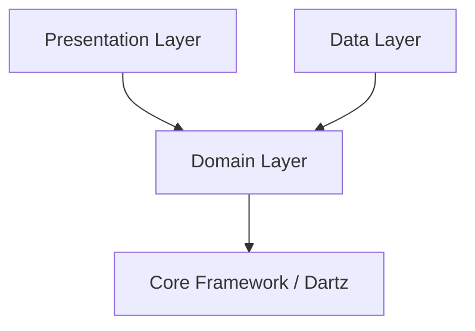
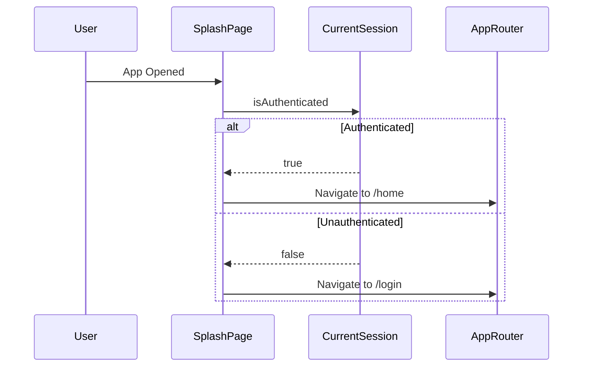

# TaskFlow Architecture

This document provides a detailed architectural overview of **TaskFlow**, an enterprise task and project management application built with Flutter using Clean Architecture principles.

---

## High Level Architecture Diagram

```
┌─────────────────────────────────────────────────────────┐
│                    Presentation Layer                   │
│      (UI Pages, Widgets, BLoC Event/State Handlers)     │
└────────────────────────────┬────────────────────────────┘
                             │
                             ▼
┌─────────────────────────────────────────────────────────┐
│                       Domain Layer                      │
│             (Entities, Use Cases, Repository Contracts) │
└────────────────────────────┬────────────────────────────┘
                             │
                             ▼
┌─────────────────────────────────────────────────────────┐
│                        Data Layer                       │
│    (Models, Repository Implementations, DataSources)    │
└────────────────────────────┬────────────────────────────┘
                             │
                             ▼
┌─────────────────────────────────────────────────────────┐
│                Data Storage / Remote Mock               │
│       (Hive Local Cache / Asset JSON / Secure Storage)  │
└─────────────────────────────────────────────────────────┘
```

---

## Feature Architecture

The application is structured using a **Feature-First Clean Architecture** organization under `lib/features/`:

```
lib/features/
├── auth/
│   ├── data/ (AuthDataSource, AuthRepositoryImpl, TokenStorage)
│   ├── domain/ (UserEntity, AuthRepository, LoginUseCase, RegisterUseCase)
│   └── presentation/ (AuthBloc, LoginPage, RegisterPage, SplashPage)
├── home/
│   ├── data/ (HomeMockDataSource, HomeRepositoryImpl)
│   ├── domain/ (DashboardSummary, HomeRepository, GetDashboardSummaryUseCase)
│   └── presentation/ (DashboardBloc, DashboardPage, DashboardHeader, QuickActions)
├── projects/
│   ├── data/ (ProjectsMockDataSource, ProjectsRepositoryImpl)
│   ├── domain/ (Project, ProjectTask, ProjectsRepository, UseCases)
│   └── presentation/ (ProjectsBloc, ProjectDetailsBloc, ProjectsListPage, DetailsPage)
├── tasks/
│   ├── data/ (TasksDataSource, TasksLocalDataSource, TaskRepositoryImpl)
│   ├── domain/ (Task, TaskDetails, TaskComment, TaskAssignee, TaskRepository, UseCases)
│   └── presentation/ (TaskListPage, TaskDetailsPage, TaskCreatePage, TaskEditPage, BLoCs)
├── notifications/
│   ├── data/ (NotificationDataSource, NotificationRepositoryImpl)
│   ├── domain/ (AppNotification, NotificationRepository, UseCases)
│   └── presentation/ (NotificationBloc, NotificationPage, NotificationBadgeButton)
└── profile/
    ├── data/ (ProfileRepositoryImpl)
    ├── domain/ (UserProfile, ProfileRepository, GetCurrentUserUseCase)
    └── presentation/ (ProfileBloc, ProfileSettingsPage)
```

---

## Dependency Flow

The dependency rule ensures that inner layers know nothing about outer layers:

- **Presentation Layer** depend on **Domain Layer** (UseCases, Entities, BLoC).
- **Data Layer** depend on **Domain Layer** (implements Repository interfaces, returns Entities).
- **Domain Layer** has ZERO dependencies on Presentation or Data layers.



---

## Authentication Architecture

Authentication is managed via `CurrentSession` and `FlutterSecureStorage`:

- **Session Checking**: On app startup, `SplashPage` checks `CurrentSession.isAuthenticated`.
- **Token Management**: `TokenStorage` persists tokens securely using `FlutterSecureStorage`.
- **Route Guarding**: `AppRouter` checks session authentication and redirects unauthenticated users to `/login`.



---

## Data Flow Example

### Loading Projects Flow

```
UI (ProjectsListPage)
   │
   │ 1. Dispatches LoadProjects(orgId)
   ▼
ProjectsBloc
   │
   │ 2. Calls GetProjectsUseCase(orgId)
   ▼
GetProjectsUseCase
   │
   │ 3. Invokes ProjectsRepository.getProjects(orgId)
   ▼
ProjectsRepositoryImpl
   │
   │ 4. Checks ConnectivityManager.isOnline
   ├─────────────────────────────┬─────────────────────────────┐
   │ (If Online)                 │ (If Offline)                │
   ▼                             ▼                             ▼
ProjectsMockDataSource       Hive Cache                    Emits Stale Data Banner
   │ (Parses mock-data.json)     │ (Retrieves stored box)
   └─────────────────────────────┴─────────────────────────────┘
                                 │
                                 ▼
                     Returns Either<Failure, List<Project>>
                                 │
                                 ▼
ProjectsBloc emits ProjectsSuccess(projects, isStale) ──► UI Rebuilds with Cards
```

---

## Offline Architecture

- **Connectivity Detection**: `ConnectivityManager` wraps `connectivity_plus` to monitor device connection status and broadcast changes.
- **Caching Strategy**: Repositories persist fetched models to `Hive` boxes or local storage when online. When offline, repositories fetch from local Hive cache and return `OfflineFailure(cachedData)`.
- **Stale Data Handling**: BLoCs convert `OfflineFailure` with cached payload into a `Success` state carrying `isStale: true`. UI displays a glass banner (`_StaleBanner`) informing the user that offline cached data is currently rendered.

---

## State Management Pattern

All state transitions follow standard BLoC lifecycle patterns using `flutter_bloc`:

```
User Action / Lifecycle
         │
         ▼
    Dispatch Event
         │
         ▼
     BLoC Engine (Executes UseCase / Async Logic)
         │
         ├───────────────────────┬───────────────────────┐
         ▼                       ▼                       ▼
   Emit Loading            Emit Success            Emit Error/Empty
         │                       │                       │
         └───────────────────────┼───────────────────────┘
                                 │
                                 ▼
                      UI Rebuild (BlocBuilder)
```

---

## Design Decisions

1. **Clean Architecture**: Decouples business rules from UI and framework APIs, making features testable in isolation.
2. **BLoC Pattern**: Provides predictable, unidirectional data flow and explicit state management (`Loading`, `Success`, `Empty`, `Error`).
3. **Repository Pattern**: Hides data sources (JSON assets, Hive cache, future REST APIs) behind a single abstract contract.
4. **Mock Datasource Abstraction**: `MockJsonDataSource` simulates real asynchronous network latencies and failure modes without requiring a running backend.

---

## Future API Migration Strategy

To replace the mock data layer with a live REST API backend:

1. **Keep Domain & Presentation Layers 100% Intact**: No changes are required in Entities, UseCases, BLoC, or UI Pages.
2. **Implement API DataSources**: Create `RemoteProjectsDataSource` using `http` or `dio` to perform network HTTP requests.
3. **Swap Dependency Injection**: Register the new API DataSources in `injection.dart` instead of `MockProjectsDataSource`.
